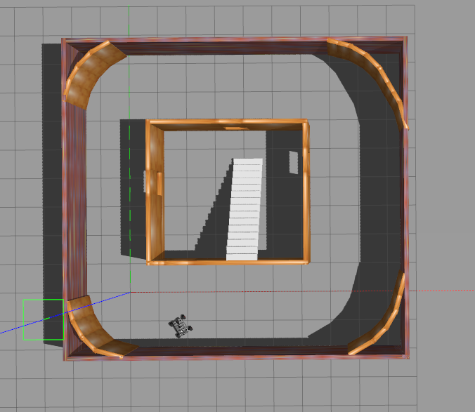
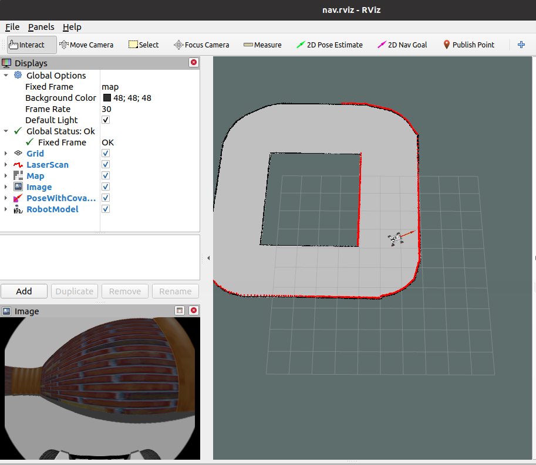
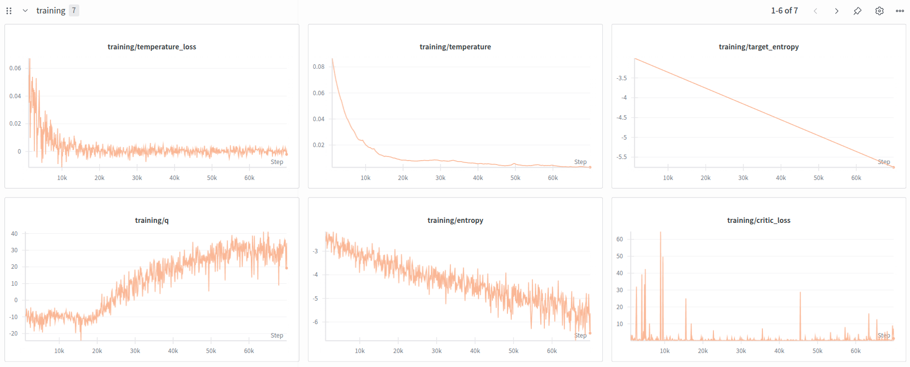

# visual navigation with RLPD

-Robot: scout-mini
-sim: Gazebo

## simulator and visulization




## RLPD training Results



## Training

launch simulator 
```python
roslaunch gazebo-sim octomap_navigation.launch 
```
start training
```python
roslaunch offroad_learning sim_training_inference.launch 
```

## Citation

[fastrlap](https://github.com/kylestach/fastrlap-release)
[rlpd](https://github.com/ikostrikov/rlpd)

```
@article{stachowicz2023fastrlap,
  title={FastRLAP: A System for Learning High-Speed Driving via Deep RL and Autonomous Practicing},
  author={Stachowicz, Kyle and Bhorkar, Arjun and Shah, Dhruv and Kostrikov, Ilya and Levine, Sergey},
  journal={arXiv preprint arXiv:TODO},
  year={2023}
} 
@misc{ball2023efficientonlinereinforcementlearning,
      title={Efficient Online Reinforcement Learning with Offline Data}, 
      author={Philip J. Ball and Laura Smith and Ilya Kostrikov and Sergey Levine},
      year={2023},
      eprint={2302.02948},
      archivePrefix={arXiv},
      primaryClass={cs.LG},
      url={https://arxiv.org/abs/2302.02948}, 
}

```
